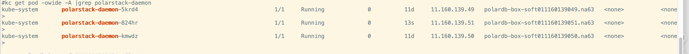
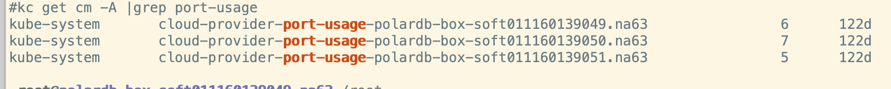
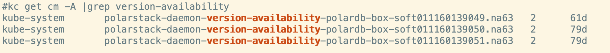
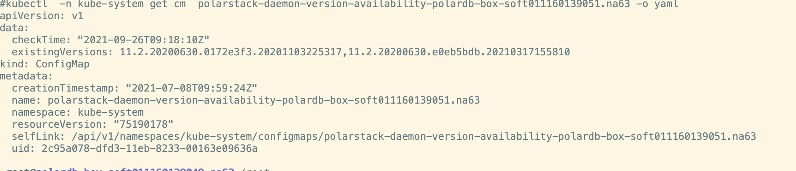

## What is PolarDB Stack Daemon？

PolarDB Stack Daemon is a component on PolarStack, a hybrid cloud  Alibaba Cloud DBaaS product, and is designed mainly for the following operations:

1. Port scanning: PolarDB Stack Daemon scans port occupation status for all the hosts and provides basic data for database engine and other components.
2. Kernal image version scanning: PolarDB Stack Daemon identifies the availability of the kernel version on the machine, so you can get basic information for database version and use the correct version for database recovery and database creating.
2. Database log cleaning: Data of database based on shared storage with one primary node and multiple read-only nodes is on the shared storage, and the log host is on local disk. Properly cleaning local log on a regular basis is important to maintain the long-term stable operation of the host and database.
4. Node network status and host status collection: PolarDB Stack Daemon regularly queries the network status of the host client network, updates the specified node condition, and provides the IP information and network status information required for connection to the database engine and one primary node and multiple read-only nodes database proxy.

## Code Structure

PolarDB Stack Daemon project uses cobra.Command to start program, mainly consists of timing task and http services. The starting part of the project code stores in the cmd directory, and business code is in the  polar-controller-manager directory.

polar-controller-manager contains the following sub-directories:

- port_usage directory：executes port scanning, and summarize the port occupation condition to the ConfigMap.
- core_version directory：Start to scan the image information of the version of the kernel on the local machine, and then perform the image scanning of the version of the kernel again according to the call, and summarize it to the execution configmap
- db_log_monitor directory： Database engine log cleaning code;
- node_net_status directory： regularly updates the k8s node condition, such as NodeClientIP、NodeClientNetworkUnavailable, NodeRefreshFlagm and client network information is stored in NodeClientIP condition for the database to communicate with cm or proxy.
- bizapis directory:  provided restful services, the corresponding contents of other directories can be called in the service under this directory；

## Quick Start

We provide two methods to use PolarDB:

- Alibaba Cloud PolarDB - Hybrid Cloud Version
- Locally implemented open source PolarStack

### Alibaba Cloud PolarDB - Hybrid Cloud Version

Alibaba Cloud PolarDB - Hybrid Cloud Version: [PolarDB Product Description](https://www.alibabacloud.com/zh/product/polarbox).

### Deploy local running instance

**Before you start**

PolarDB Stack Daemon runs on each node machine in the form of k8s daemonset, and executes operation commands on the machine through SSH. Before deployment, you must ensure that k8s is installed, all components of k8s are running normally, and all hosts have opened up password free access to each other.

Steps:

1. Download PolarDB Stack Daemon source code at: https://github.com/ApsaraDB/PolarDB-Stack-Daemon
2. Install k8s and ensure that k8s components are in normal operation.
3. Install related dependencies: kubectl create -f all.yaml.

   **Note:**  This yaml file contains all the contents required for polarstack daemon deployment.

a, Netword card configuration ccm-config configmap：

- - Configure NET_CARD_NAME business network card name. NET_MASK business network card subnet mask.

b, Create ClusterRole、ServiceAccount、ClusterRoleBinding for PolarStack-Daemon running

- - ClusterRole：cloud-controller-manager
- ClusterRoleBinding：cloud-controller-manager

- - ServiceAccount：cloud-controller-manage

c, Main start parameters:

- - Parameters of the directory where database log stores: dbcluster-log-dir
- Logs clean rules (per day): ins-folder-overdue-days

- - Labels of the ConfigMap where kernel version information stores: core-version-cm-labels

d, k8s daemonset settings:

- - access some commands of the host with SSH, and /root/.ssh is mounted
- The directory of polarstack-daemon log is /var/log/polardb-box/polardb-net, and the directory is mounted
- access the local network because the daemon-set uses the host network:hostnetwork: true

4. Check running status.

​     After PolarDB Stack Daemon deployment, you can check the daemonset pod status, k8s node condition, port scan and clean ConfigMap of k8s, and kernel image version ConfigMap to see whether it functions well.

​    a, PolarDB Stack Daemon's pod running status. There is a pod of polarstack-daemon on each host, and check that they are all in running status.

​    kubectl get pod -owide -A |grep polarstack-daemon

​    b, Check port scan status, PolarDB Stack Daemon pod tries to listen port to identify port occupation status of the host, and get the port to ConfigMap.

​    kubectl get cm -A |grep port-usage

​    c, Check the kernel version. During startup, PolarDB Stack Daemon queries the configmap of kernel image version information according to the parameter value, and then query whether these image information exists on the machine according to the configmap.

​     kubectl get cm -A |grep version-availaility

As shown in the figure below, two kernel versions 11.2.20200630.0172e3f3.20201103225317 and 11.2.20200630.e0eb5bdb.20210317155810 exist on the polardb-box-soft011160139051 host.

## Contribution

Your contribution is greatly appreciated. Refer to contributing for development and pull request.

## Software license description

PolarDB Stack Daemon's code was released under the Apache version 2.0 software license. See[License](https://github.com/alibaba/PolarDB-for-PostgreSQL/blob/master/LICENSE) and [NOTICE](https://github.com/alibaba/PolarDB-for-PostgreSQL/blob/master/NOTICE)。

## Acknowledgement

Some of the codes and design methodology are influenced by other openspurce program, such as kubernets and Gin. We appreciate their contribution.

## Contact us

Use the DingTalk to scan the following QR code and join the PolarDB technology group.

